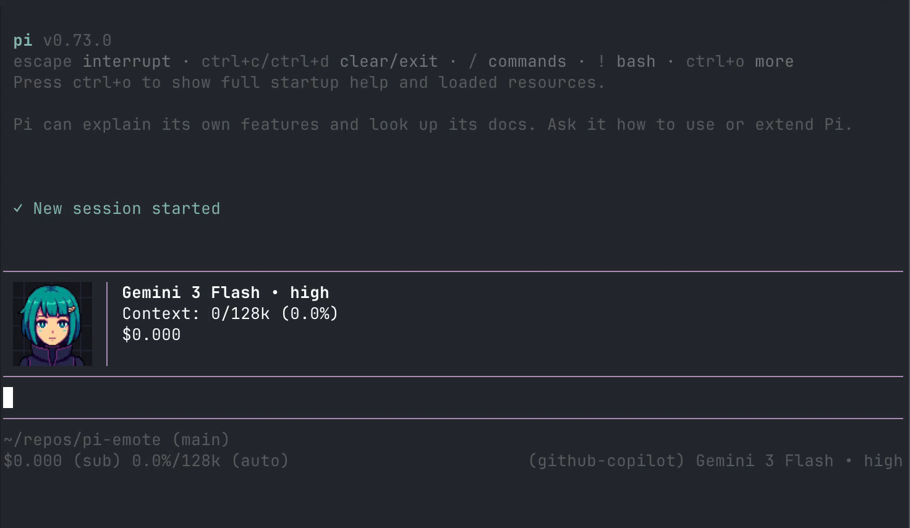

# CGx's pi-emote

Animated pixel-art emote that lives in the top-right corner of your pi TUI session. Reacts to what the agent is doing — thinking, talking, reading, writing, using tools, etc.



Requires a Kitty-graphics-capable terminal.

## Install

```bash
pi install git:github.com/cgxeiji/pi-emote
```

## States

| State   | Trigger                                 |
| ------- | --------------------------------------- |
| hi      | Session start                           |
| idle    | Nothing happening (blinks occasionally) |
| think   | Reasoning tokens streaming              |
| talk    | Text response streaming                 |
| read    | `read` tool / reading tool output       |
| write   | `write` or `edit` tool                  |
| tool    | Any other tool                          |
| success | Successful tool execution               |
| failure | Failed tool execution                   |
| compact | Context compaction                      |

## Config

`config.json` in the extension root:

```json
{
  "enabled": true,
  "size": 8,
  "readingSpeed": 4,
  "hideBelow": 80,
  "holdDuration": { "hi": 2000, "success": 1200, "failure": 1200 },
  "blinkInterval": [3000, 6000],
  "talkTickMs": 120,
  "cycleMs": 500,
  "idle": { "default": "idle.png", "blink": "idle_blink.png" },
  "talk": {
    "weights": {
      "talk_close.png": 0.15,
      "talk_small.png": 0.3,
      "talk_mid.png": 0.35,
      "talk_wide.png": 0.2
    }
  }
}
```

- `size` — image width/height in terminal cells
- `readingSpeed` — words/sec, controls how long talk mouth stays open after tokens stop
- `hideBelow` — hide emote when terminal is narrower than this many columns
- `idle` & `talk` — global default animation settings for all characters

## Multi-Character Support

The extension scans two locations for characters:

1.  **Local:** `emotes/` folder inside the extension directory.
2.  **Global:** `~/.pi/agent/emote/` in your home directory (ideal for user-added characters).

If a character exists in both locations, the **Global** version takes precedence.

Switch between characters in chat using:
`/emote switch`

The selected character is saved in `config.json`.

## Custom emotes

Place PNGs into `~/.pi/agent/emote/<character>/<state>/`. The extension auto-discovers frames per directory.

### Structure:

`~/.pi/agent/emote/<character>/<state>/<frame>.png`

### Optional Config:

You can add an `emotes.json` inside your character folder to override global animation settings (like mouth weights or specific blink frames). If omitted, the character will use the defaults defined in the root `config.json`.

## License

MIT
